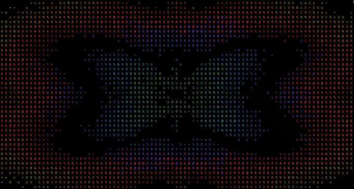
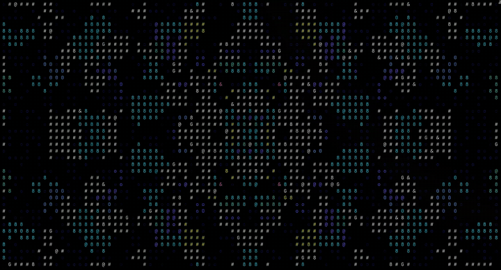
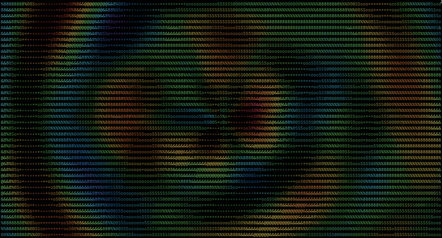

# glyphfield

A full-screen terminal animation: a grid of glyphs painted by a moving
geometric pattern. It was built as a screensaver for
[Omarchy](https://omarchy.org), but it runs in any truecolor terminal.

It's a single Python file with no dependencies, and needs Python 3.11 or newer.

## Styles

| kaleido | mirror | bloom |
|---|---|---|
|  |  |  |

- **kaleido**: a swirling kaleidoscope. Colored bands and glyph weights come
  from interference patterns folded into mirrored sectors.
- **mirror**: works like a real kaleidoscope. Small "beads", each a cluster of
  identical glyphs in one color and a random pixel pattern, are born at the
  center. They stream outward and grow toward the corners, and every bead is
  mirrored four ways (eight with `--folds 8`).
- **bloom**: rings breathing out from the center, with spiral dark ripples.

The layout adapts to the terminal's shape, so portrait and landscape displays
both fill the screen. The animation clock speeds up and slows down at
irrational rates, so the pattern never repeats exactly. Use `--steady` for
constant speed and an exact loop.

## Usage

```sh
glyphfield                  # style and settings from the config file
glyphfield --style mirror   # pick a style
glyphfield --tune           # live settings overlay
```

Any key exits, except in `--tune`, where `q` quits.

### Tuner

`glyphfield --tune` runs the animation full-size with a settings panel in the
top-left corner:

| Key | Action |
|---|---|
| `↑` `↓` | pick a setting |
| `←` `→` | adjust it (`[` `]` for ×5) |
| `tab` or `1` `2` `3` | switch style |
| `space` | toggle on/off settings |
| `r` / `R` | reset one setting / the whole style |
| `s` | save to the config file |
| `h` | hide the panel |
| `q` | quit |

Mirror exposes the bead count, bead size, glyphs per bead, symmetry, ring
spacing, center motif size and per-color weights.

### Config

Settings live in `~/.config/glyphfield/config.toml`, with one table per style
and a top-level `style`. The tuner writes this file. Command-line flags
override it.

## Install

```sh
git clone https://github.com/gig3m/glyphfield
cd glyphfield
./install.sh              # Omarchy: installs glyphfield and makes it the screensaver (kaleido)
./install.sh mirror       # same, with another style
./install.sh --no-screensaver   # any system: just the glyphfield command
```

Commands are symlinked into `~/.local/bin`, so a `git pull` updates them in
place. `./uninstall.sh` puts everything back.

### How the Omarchy screensaver hookup works

Omarchy's idle service hardcodes `omarchy-launch-screensaver`. `shell.json` has
no setting for it, and `/usr/share/omarchy/bin` comes before `~/.local/bin` on
the path, so replacing that script in `~/.local/bin` has no effect. The
installer therefore follows the pattern of
[omarchy-matrix-screensaver](https://github.com/etyurkin/omarchy-matrix-screensaver):

- Uses `omarchy plugin clone omarchy.idle` to clone the idle service into your
  own `<user>.idle` plugin, swaps that one command for
  `glyphfield-launch-screensaver`, and enables the clone in place of the stock
  service. The idle service stays loaded across plugin reloads, so the
  installer restarts the Omarchy shell (`omarchy-restart-shell`) for the switch
  to take effect.
- Installs `glyphfield-launch-screensaver`, which opens one terminal per monitor
  like Omarchy's launcher. It uses the same `org.omarchy.screensaver` window
  class, so the idle service still tracks the screensaver.
- Installs `glyphfield-screensaver`, which runs glyphfield with Omarchy's exit
  rules: any key, or focus leaving the window, closes the screensaver on every
  monitor.
- Adds a post-update hook that re-copies Omarchy's idle service after each
  update and re-applies the swap. Your clone keeps getting upstream fixes, and
  if Omarchy ever changes how the screensaver starts, you get a notification
  instead of the screensaver silently not appearing.

The screensaver style lives in `~/.config/glyphfield/screensaver`. Its look is
whatever you last saved from `glyphfield --tune`. Empty that file to go back
to Omarchy's stock screensaver without uninstalling.

## License

MIT
